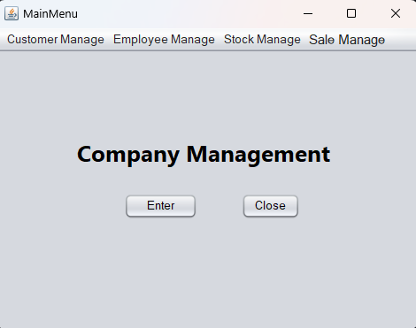
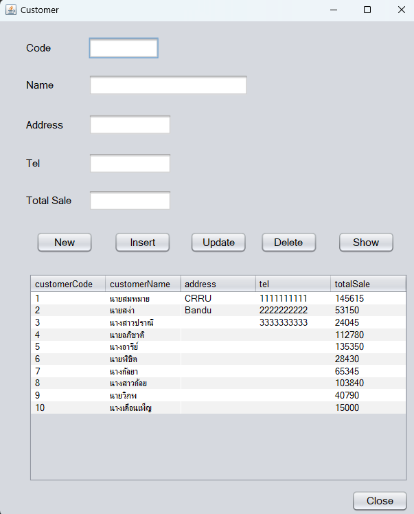
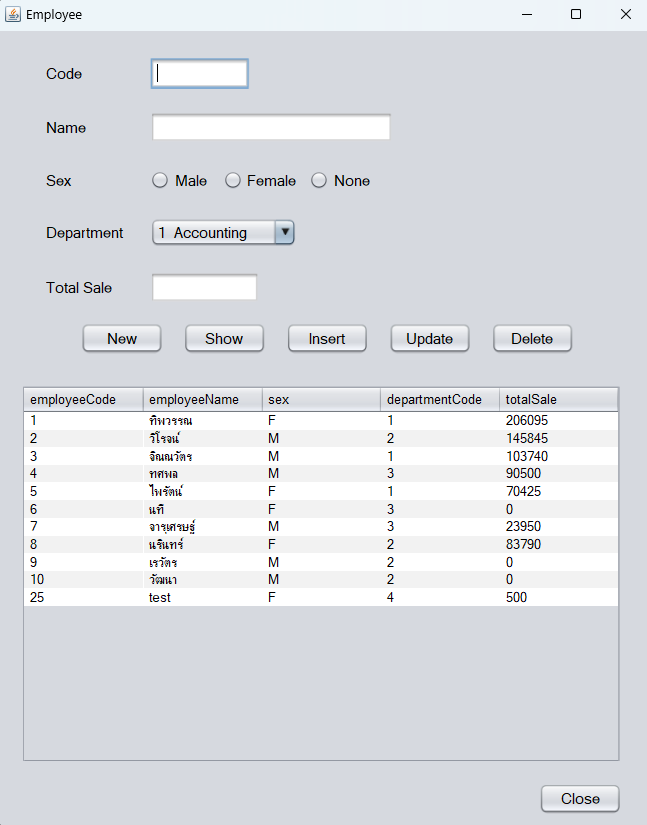
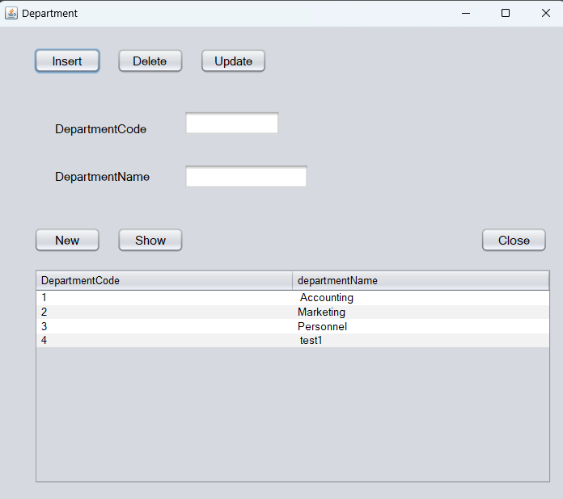
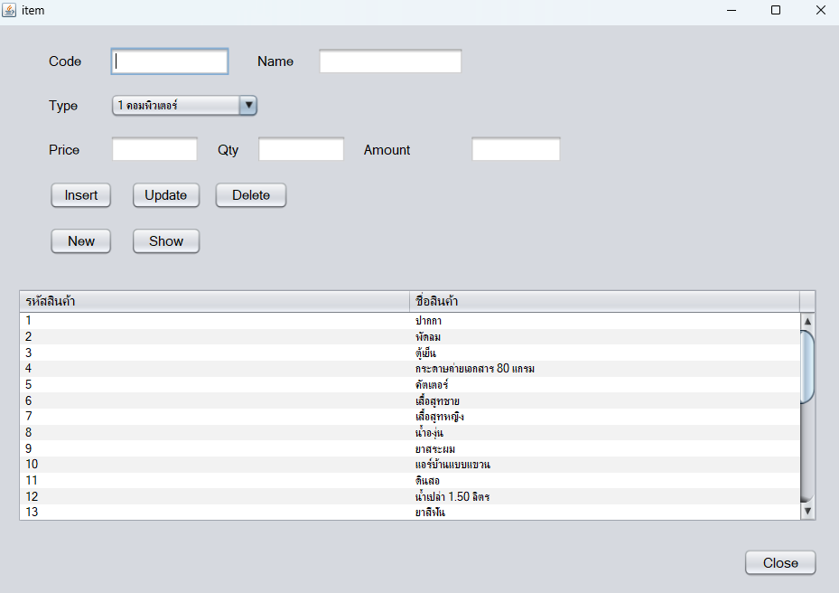
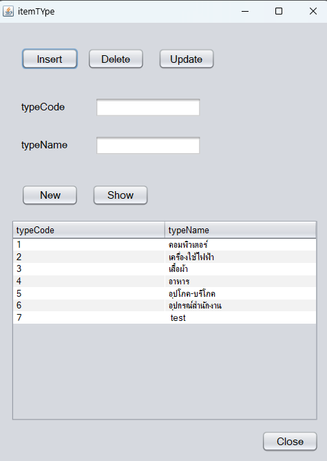
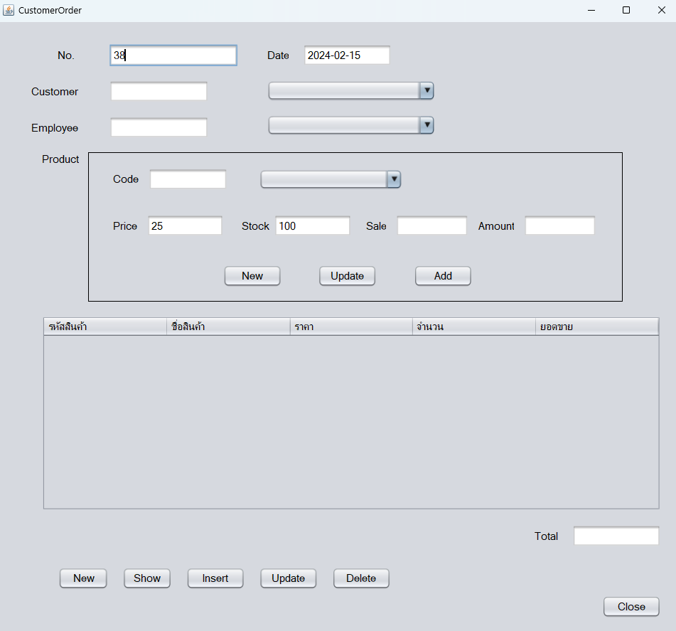

# ---Java-Project---
## *Learn-Java-OOP*
### โปรแกรมจัดการสต๊อกสินค้า 
### Database : MySQL
### Connect Use : Connector/J

### <ins> หน้าเมนู </ins> 

### <ins> จัดการลูกค้า </ins> 

### <ins> จัดการพนักงาน </ins> 

### <ins> จัดการแผนก </ins> 

### <ins> จัดการสินค้า </ins> 

### <ins> จัดการประเภทสินค้า </ins> 

### <ins> จัดการออร์เดอร์ </ins> 

